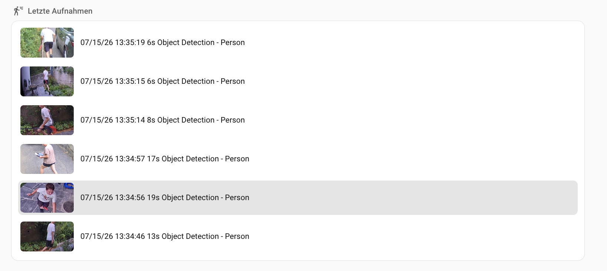
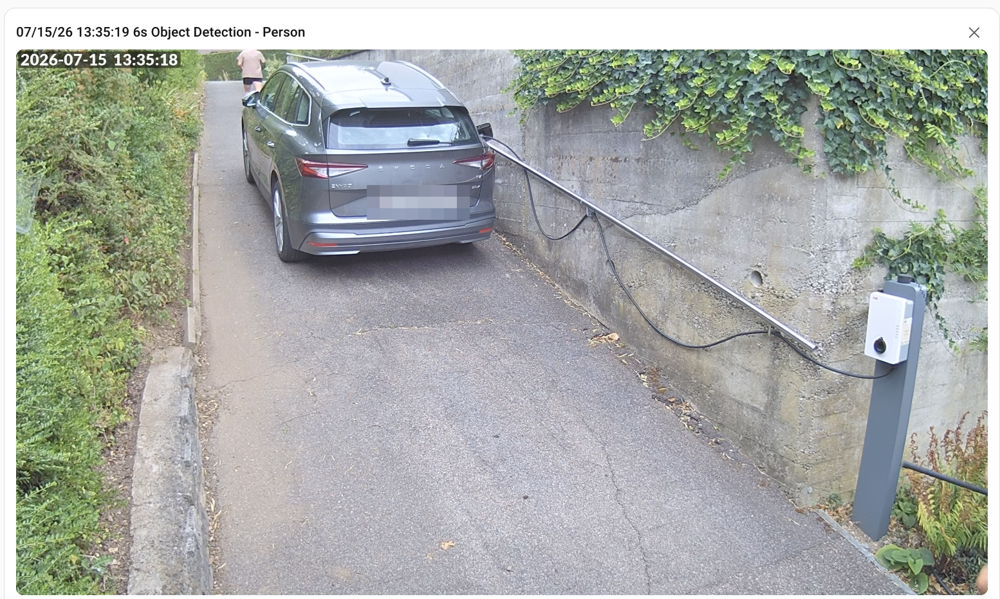
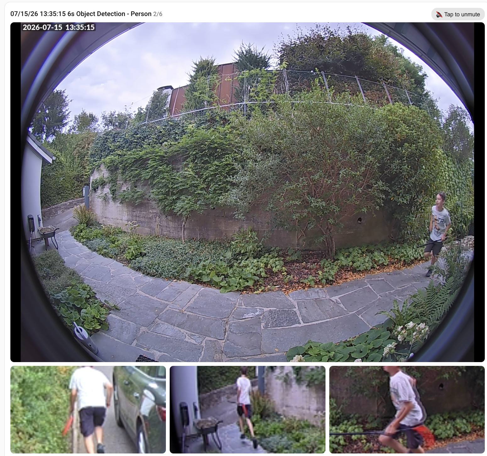

# Media Gallery List Card

A Home Assistant Lovelace card that shows the **newest videos from any media source**
and plays them **inline** on your dashboard.



If you can see it in Home Assistant's **Media** browser, this card can show it:

- 📹 NVR / camera recordings — **UniFi Protect**, **Frigate**, **Reolink**,
  **Synology Surveillance Station**, Blue Iris, …
- 💾 Video folders on a NAS or SMB/DLNA share
- 📁 Local media (`/media`, `/config/www`) — dashcam uploads, timelapses,
  clips saved by automations

No integration of its own, no automations, no file copies: the card talks to the same
`media_source` WebSocket API the built-in Media Browser uses, so **any provider works
out of the box** — current and future ones.

## Features

- Flat list of the newest N videos from a folder you pick — zero-click recency
- **List or grid layout** (`columns: 1–6`, tiles with caption overlay)
- **Configurable aspect ratios** (16:9, 4:3, 1:1) — separately for grid tiles,
  list thumbnails, and the inline player
- **Inline playback**: tap a row/tile, the clip plays right in the card
- **Custom title format** (`title_format: DD.MM.YYYY HH:mm`) — timestamps are
  auto-detected in the provider's titles (UniFi Protect, Frigate, ISO filenames,
  epoch) and re-formatted the way you want
- **Kiosk rotation**: plays the newest N back-to-back and loops — great for wall
  tablets (starts muted per browser policy, tap-to-unmute)
- **Built-in source browser**: click through the media tree in the card editor and
  pick your folder — no URI hand-editing
- Signed thumbnails, empty state, readable inline errors, English/German UI

**Inline playback** — tap a row, the clip plays right there:



**Kiosk rotation** — clips play back-to-back with position indicator and tap-to-unmute:



## Installation

### HACS (recommended)

1. HACS → three-dot menu → **Custom repositories**
2. Add `https://github.com/stefanschaedeli/media-gallery-list-card` as type **Dashboard**
3. Search for **Media Gallery List Card**, download, and reload your browser

### Manual

Copy `media-gallery-list-card.js` from the latest release to `/config/www/` and add
`/local/media-gallery-list-card.js` as a dashboard resource (type: JavaScript module).

## Quick start

Add the card via the dashboard's **Add Card** dialog, click **📂 Browse** next to the
media source field, click down to the folder you want, and hit **✓ Use this folder**.
Done — the card lists that folder's newest videos.

## Configuration

```yaml
type: custom:media-gallery-list-card
media_source: media-source://…   # pick it with the built-in browser
title: Latest clips
max_items: 3
```

| Option | Type | Default | Description |
| --- | --- | --- | --- |
| `media_source` | string | **required** | A `media-source://…` URI of a browsable folder — use the editor's 📂 Browse button |
| `max_items` | number | `3` | How many of the newest videos to list (1–20) |
| `title` | string | – | Optional card heading |
| `layout` | `list` \| `grid` | `list` | Rows with side thumbnails, or a tile grid |
| `columns` | number | `3` | Tiles per row in grid layout (1–6) |
| `grid_aspect_ratio` | `16:9` \| `4:3` \| `1:1` | `16:9` | Aspect ratio of grid tiles |
| `list_aspect_ratio` | `16:9` \| `4:3` \| `1:1` | `16:9` | Aspect ratio of list-row thumbnails |
| `player_aspect_ratio` | `auto` \| `16:9` \| `4:3` \| `1:1` | `auto` | Inline player: `auto` keeps the video's native ratio; a fixed ratio crops the video to fill the frame (HLS via `ha-hls-player` is clipped to the frame rather than cover-cropped) |
| `show_title` | boolean | `true` | Show video titles (list rows / grid captions) |
| `title_format` | string | – | Re-format the date/time in item titles, e.g. `DD.MM.YYYY HH:mm` — see [Title format](#title-format). Empty = show the provider's raw title |
| `autoplay_rotation` | boolean | `false` | Kiosk mode: play the newest N back-to-back, looping; re-fetches the list each loop. Starts muted (browser policy) with a tap-to-unmute pill |
| `rotation_show_list` | boolean | `false` | With rotation: keep the tappable list below the player (tap = jump to that clip) |
| `refresh_interval` | number | `0` | Auto-refresh the list every N seconds (0 = off) |
| `reverse` | boolean | `false` | Flip item order for sources that sort oldest-first |

> **Note:** quote aspect-ratio values in YAML (`grid_aspect_ratio: "16:9"`) — some
> YAML parsers read an unquoted `16:9` as a number.

### Title format

The card itself has no idea when a clip was recorded — it only sees the **title
string** the media source provider returns (and the item's media content id). Most
providers embed a date and time in there, each in its own style:

| Provider | Raw title looks like |
| --- | --- |
| UniFi Protect | `07/30/26 16:21:24 6s Object Detection - Person` |
| Frigate | `2026-07-30 16:21:24` (or an event id like `1753877525.123456-abcdef`) |
| Camera / dashcam files | `20260730_162124.mp4` |

Set `title_format` and the card transforms that into exactly the text you want:

```yaml
type: custom:media-gallery-list-card
media_source: media-source://unifiprotect/xxxxxxxxxxxx:browse:all:smart:recent:1
max_items: 5
title_format: DD.MM.YYYY HH:mm
```

`07/30/26 16:21:24 6s Object Detection - Person` → **`30.07.2026 16:21`**

More format examples (same source title as above):

| `title_format` | Shown title |
| --- | --- |
| `DD.MM.YYYY HH:mm` | `30.07.2026 16:21` |
| `HH:mm:ss` | `16:21:24` |
| `D.M. h:mm A` | `30.7. 4:21 PM` |
| `[Clip vom] DD.MM. [um] HH:mm` | `Clip vom 30.07. um 16:21` |

#### How it works

For every listed item the card runs three steps:

1. **Find a timestamp.** It scans the item's title, then its media content id, and
   takes the first pattern that matches:
   - ISO style — `2026-07-30 16:21:24`, `2026-07-30T16:21`, `2026/07/30 16:21`
   - Compact filename — `20260730_162124` or `20260730-162124`
   - Locale style — `30.07.2026 16:21`, `30.07.26, 16:21`, `7/30/2026, 4:21:24 PM`
     (with `.` separators the day comes first, with `/` the month — unless the first
     number is >12, which forces day-first)
   - Epoch seconds or milliseconds — `1753877525`, incl. Frigate event ids like
     `1753877525.123456-abcdef` (only values that land in the years 2001–2099 count,
     so random digit runs aren't mistaken for dates)
2. **Render your format.** The tokens below are replaced with the extracted
   date/time; everything else (`.`, `:`, `-`, spaces, …) passes through as-is, and
   square brackets protect literal text that would otherwise be parsed as tokens:
   `[Clip vom] DD.MM.` → `Clip vom 30.07.`

   | Token | Output | Token | Output |
   | --- | --- | --- | --- |
   | `YYYY` / `YY` | `2026` / `26` | `HH` / `H` | `08` / `8` (24 h) |
   | `MM` / `M` | `07` / `7` | `hh` / `h` | `08` / `8` (12 h) |
   | `DD` / `D` | `30` / `30` | `mm` / `m` | `05` / `5` |
   | `A` / `a` | `PM` / `pm` | `ss` / `s` | `09` / `9` |

3. **Fall back safely.** If no timestamp is found in either field, the raw provider
   title is shown unchanged — a wrong `title_format` can never blank out your list.
   Note that any non-date text in the original title (like UniFi's
   `Object Detection - Person`) is **replaced**, not kept; if you want it, the raw
   title is the way to get it (leave `title_format` unset).

The formatted title is used everywhere the title appears: list rows, grid tile
captions, and the player bar.

## Examples

**Security recordings, tile wall (UniFi Protect shown — any NVR provider works the same):**

```yaml
type: custom:media-gallery-list-card
title: Letzte Aufnahmen
media_source: media-source://unifiprotect/xxxxxxxxxxxx:browse:all:smart:recent:1
max_items: 6
layout: grid
columns: 3
grid_aspect_ratio: "1:1"
title_format: DD.MM.YYYY HH:mm
```

**Kiosk player for a wall tablet (loops the newest clips, picks up new ones automatically):**

```yaml
type: custom:media-gallery-list-card
media_source: media-source://frigate/frigate/event/clips/all/all/recent/1
max_items: 5
autoplay_rotation: true
```

**Newest clips from a local folder (e.g. saved by an automation or synced from a dashcam):**

```yaml
type: custom:media-gallery-list-card
title: Dashcam
media_source: media-source://media_source/local/dashcam
max_items: 3
show_title: false
```

### Finding a media-source URI manually

The editor's **📂 Browse** button is the easy way. If you prefer doing it by hand:
open **Media** in the sidebar and navigate to your folder — the page URL contains the
URI, URL-encoded (the part starting with `media-source%3A%2F%2F…`). Decode it
(`%3A` → `:`, `%2F` → `/`) and use it as `media_source`.

## Notes

- Playable URLs are resolved on tap (they are short-lived signed URLs).
- HLS streams use Home Assistant's own `ha-hls-player` when available; MP4 plays in a
  native `<video>` element.
- The card lists the *videos directly inside* the configured folder (no recursion) —
  pick the folder that already aggregates what you want to see (most NVR providers
  offer "recent" folders exactly for this).
- Requires Home Assistant 2024.x or newer (uses `media_source/browse_media`,
  `media_source/resolve_media`, `auth/sign_path`).

## License

MIT
